# ZSS: Zipper logic revisited

[Marius Buliga](https://mbuliga.github.io/)

This is based on the transcript of a talk from September 2020, which I gave at the [Quantum Topology Seminar](https://www.dropbox.com/sh/5c3xihm2mkdo5s5/AADl_aRwAB3EfT2YpiLfCRZ-a?dl=0) organized by Louis Kauffman.

There is a [video of the talk](https://www.dropbox.com/sh/5c3xihm2mkdo5s5/AABDoNpc6K4XioJqesIy6vdma/MariusBuliga?dl=0&preview=zoom_0.mp4&subfolder_nav_tracking=1) and a [github repository](https://github.com/mbuliga/zss) associated with ZSS. This transcript is also [available on telegram](https://telegra.ph/ZSS-Zipper-logic-revisited-06-09).

**The problem:** can we compute with tangles and Reidemeister moves? I am going to tell you where does this problem comes, from my point of view, why it is different than the usual way of using tangles in computation and then I’m going to propose you an improvement of the thing called zipper logic, namely the way to do universal computation using tangles and zippers.

The problem is to compute with Reidemeister moves, i.e by use of a graph rewrite system which contains the tangle diagrams as graphs and Reidemeister moves as graph rewrites.

Can we do universal computation with this?

## Where does this problem come from?

This is not the usual way to do computation with tangles. The usual way is that we have a circuit which we represent as a tangle, a knot diagram, where the crossings and maybe caps and cups are operators which satisfy the algebraic equivalent of the R moves. 

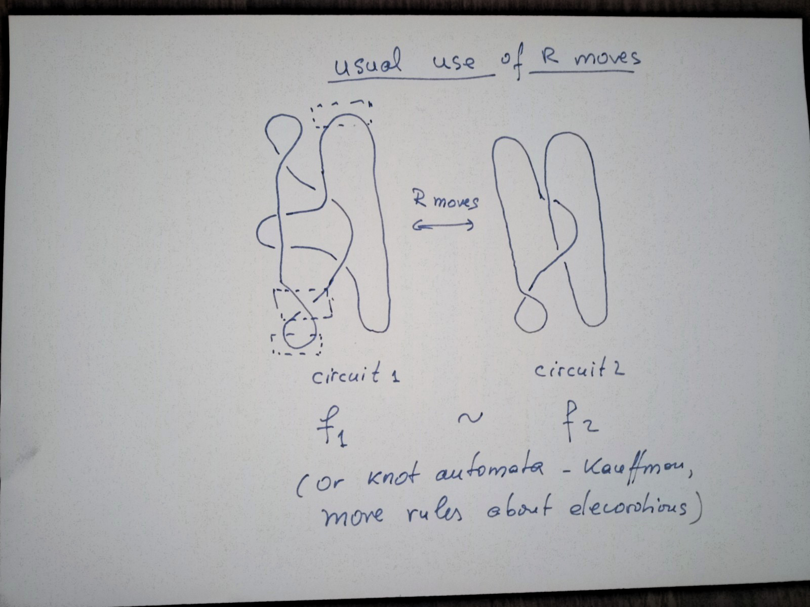

Each circuit represents a computation. When we have two circuits, then we can say that they represent equivalent computations when we can turn one into another by using R moves.

As an example, in graphical formalisms used for quantum computation [like ZX calculus](https://arxiv.org/pdf/0906.4725.pdf) we have preparation (cups), detectors (caps) and crossings are quantum gates. R moves and cup-cap annihilation graph rewrites transform a computation into another. The well known example of teleportation shows that two computation are equivalent. The first computation has associated a graph which  represents the teleportation experiment. It is not clear what is the effect of this computation. The second computation is obviously clear to us (teleportation) but it is not clear how we can realize this computation in practice. The equivalence (not via R moves in this case, but involving the annihilation of a cup with a cap) between the two graphs show that these two graphs represent the same computation, therefore we obtain an explanation why the experimental setting achieves the effect of teleportation. 

We see here that the graph rewrites don’t compute by themselves, instead they are used to prove that two computations are equivalent. The graph rewrites do not compute!

My source of interest in the problem if we can compute with the R moves comes from emergent algebras, introduced in [arXiv:0907.1520](http://arxiv.org/abs/0907.1520) and their graphical representations using tangles [arXiv:1103.6007](http://arxiv.org/abs/1103.6007). An e.a. is a combination of algebraic and topological information. 

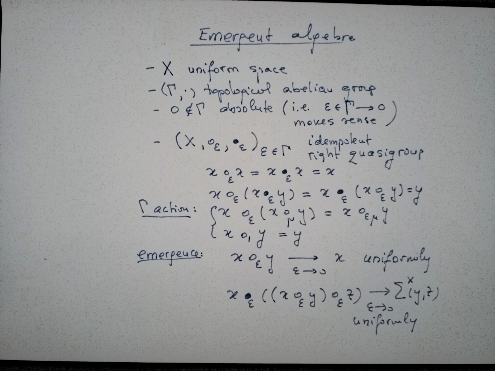

See [A problem in emergent algebras](https://mbuliga.github.io/colin/colin.pdf)  for a short description of emergent algebras and 
[arXiv:1807.02058](https://arxiv.org/abs/1807.02058) for an associated lambda calculus style term rewriting system. 

By the usual correspondence between quandles and crossings, in emergent algebras we can perform the Reidemeister 1 and 2 moves, but not the R3. On the other hand, we can pass to the limit with the parameter which decorates the operations (or crossings).

This passage to the limit produces emergent objects and properties. Here is how. 

This is the configuration which gives the approximate sum.

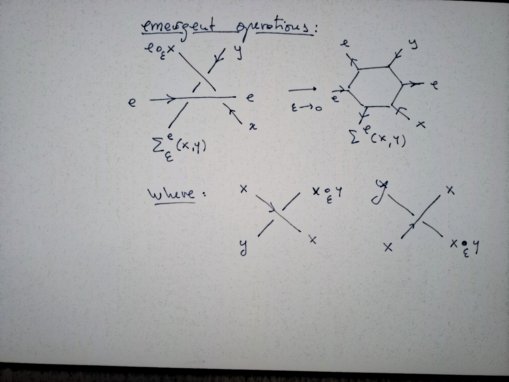

 The crossings represent emergent algebra operations. The graphical representation tells  that as epsilon goes to 0 you obtain in the limit some gate (the sum gate, drawn as a hexagon) which has 3 inputs and 3 outputs. 

We say that the sum is an emergent object because it emerges from the limit. We can also define in the same way the derivative of a function, graphically.

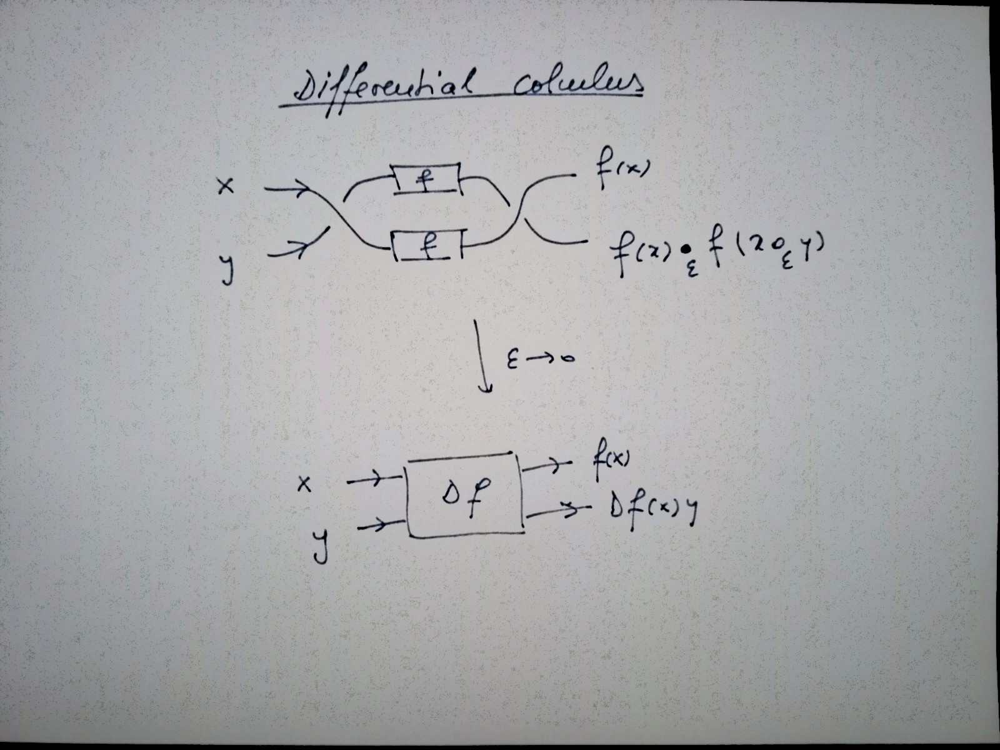

We can define not only emergent objects, but also emergent properties.

Here you see an example: we use the R2 rewrites and passage to the limit to prove that the addition is associative.

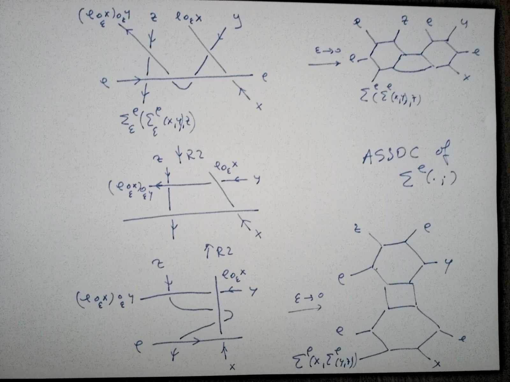

The moral is: you pass to the limit from left to right of the figure and you use R2 rewrites from up to down, to obtain the associativity of the sum operation in graphical form.

Another example: if you define a new crossing (relative crossing) then you can pass to the limit and you can prove that, based on e.a. axioms, including a passage to the limit, the R3 emerges.

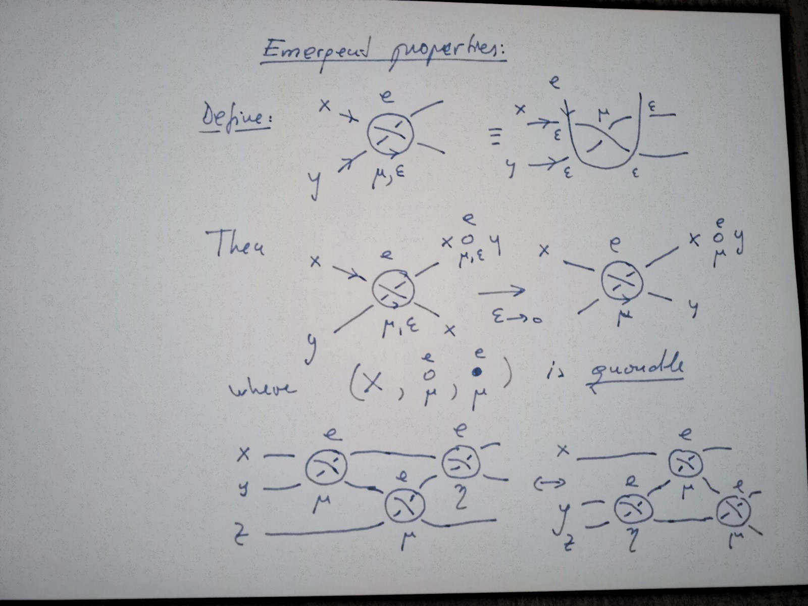

Indeed, what we see is that the relative crossing satisfies R1, R2 and R3, compared with the original crossing which satisfies only R1 and R2.

 

With e.a. we can do differential calculus. We use only R1, R2 and a passage to the limit. It is a differential calculus which is not commutative.

There are interesting classes of e.a.:

  *  linear e.a. correspond to calculus on conical groups (Carnot groups are a particular class encountered in sub-riemannian geometry, for example)
    
  *  commutative e.a. which satisfy SHUFFLE (leads to the usual calculus in topological vector spaces) In this class you can do any computation ([Pure See](https://mbuliga.github.io/quinegraphs/puresee.html))

Technically, what I want to know is: can you do universal computation in the linear case? This corresponds to the initial problem.

## What means universal computation? 

There are many, but among them, 3 ways to define what computation means. They are equivalent in a precise sense.

Lambda calculus is a term rewrite system. 

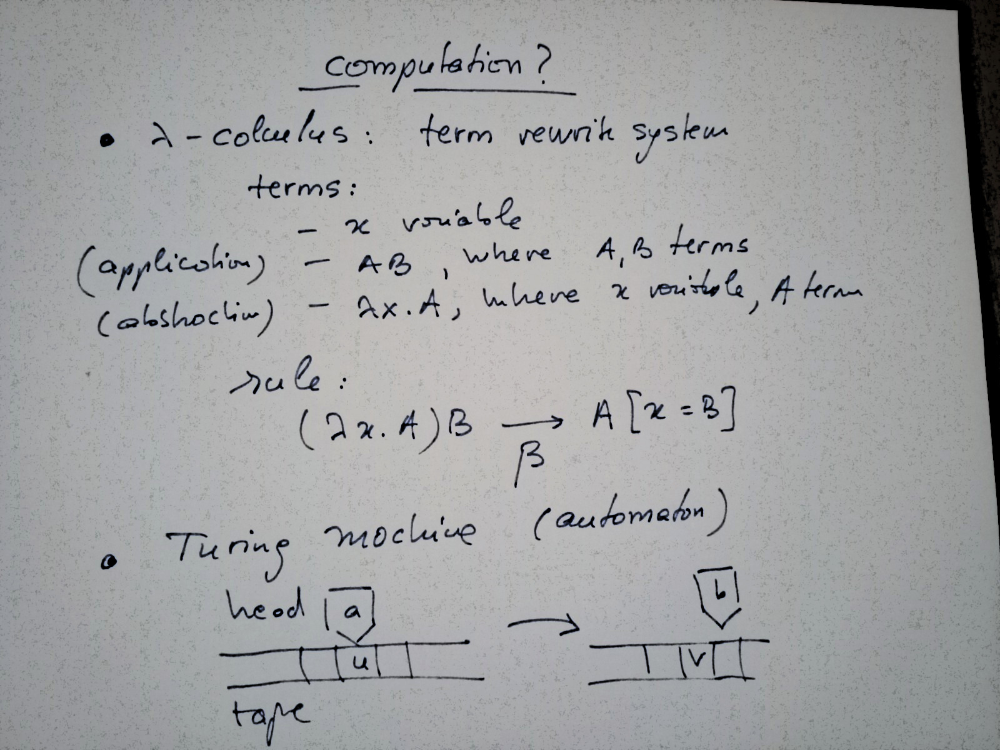

A Turing machine is an automaton.

Lafont’ [Interaction Combinators](https://pdfs.semanticscholar.org/6cfe/09aa6e5da6ce98077b7a048cb1badd78cc76.pdf) is a graph rewrite system, where you use graphs with two types of 3 valent nodes and one type of 1 valent node.  Mind that we work with [port graphs](http://citeseerx.ist.psu.edu/viewdoc/download?doi=10.1.1.18.5446&rep=rep1&type=pdf), where nodes have numbered ports.

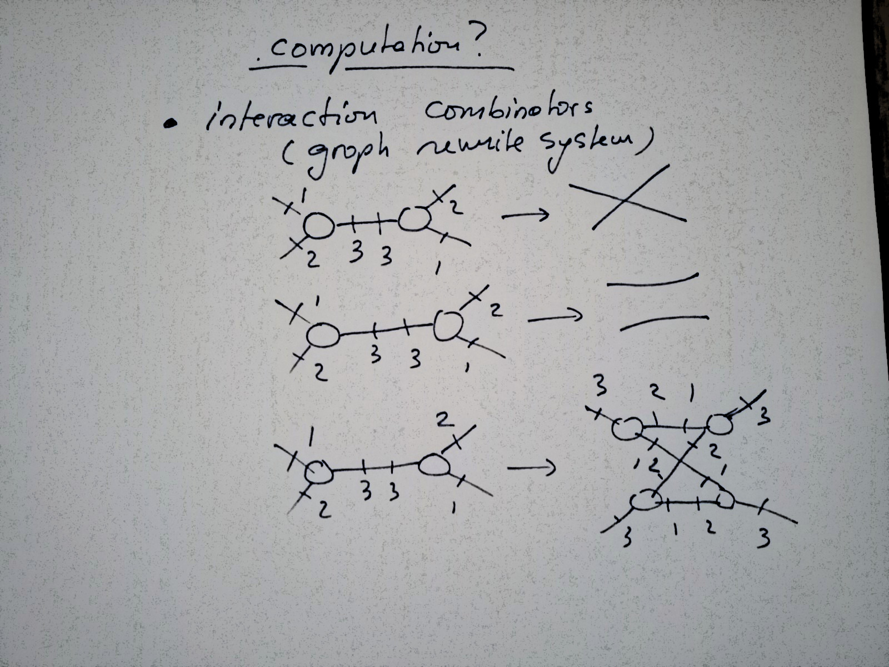

Not shown here are IC rewrites which delete nodes.

Lafont proves that his graph rewrite system is universal because he can implement Turing machines. 

There is a lot of work to implement lambda calculus in a graph rewrite system, in particular in interaction combinators. The reality is that this is extremely dificult, in the sense that there are solutions, but the solutions are not what we want. You can transform a lambda term into a graph and then reduce it with the graph rewrite system of Lafont, for example, and then you can decorate the edges of the graph so that you can retrieve the result of the computation. But while the graph rewrite system and the algorithm of rewrite applications are local, the parsing from lambda calculus to graphs and back are non local (there is no a priori upper bound of the number of nodes and edges involved). Differently from the graph rewrite systems we are interested in, term rewrite systems are non-local. [See Asemantic computing](https://telegra.ph/Asemantic-computing-03-02).

We have 3 definition of what computation means, by 3 different models, which are equivalent only if you add supplementary hypotheses. For me IC is the most important one, but we don’t know yet how to compute with IC only.

Let me reformulate the problem of if we can compute with R moves.

We can associate a knot quandle to a knot diagram, simply by naming the arcs, then we get a presentation of a quandle. 

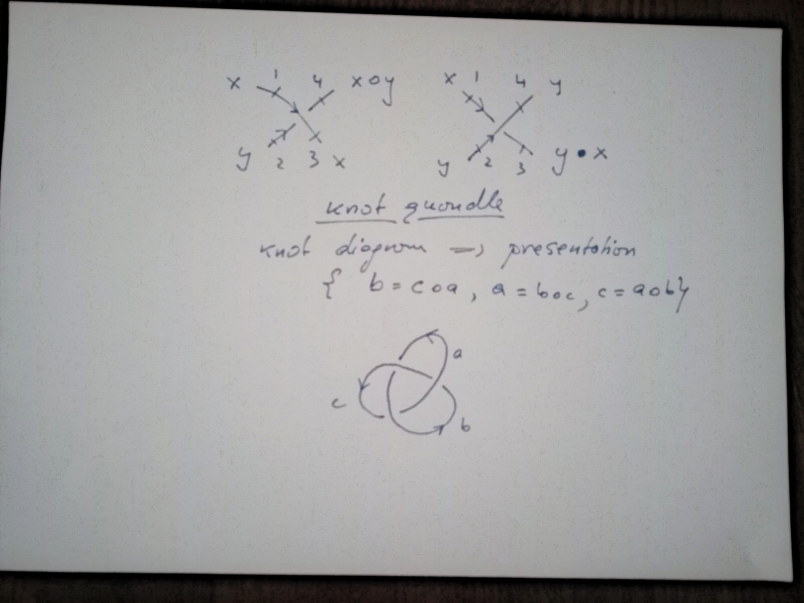

The presentation of a quandle is invariant with respect to the permutation of relations  or the renaming of the arcs. There is a small problem, we have to introduce fanin and fanout nodes too. For example when an arc passes over  two crossings, we have a hidden fanout. The solution is to use a different notation and FIN (fanin) and FO (fanout) nodes. This turns the presentation into a [mol file](https://arxiv.org/abs/2003.14332), like described in the following figure.

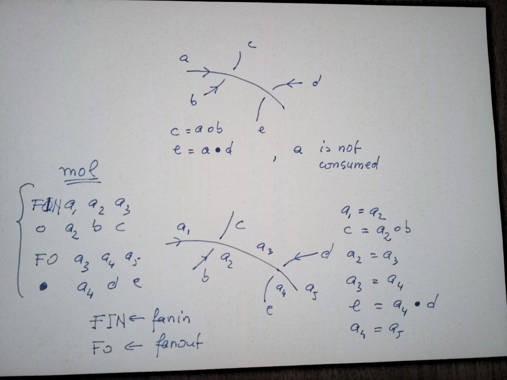

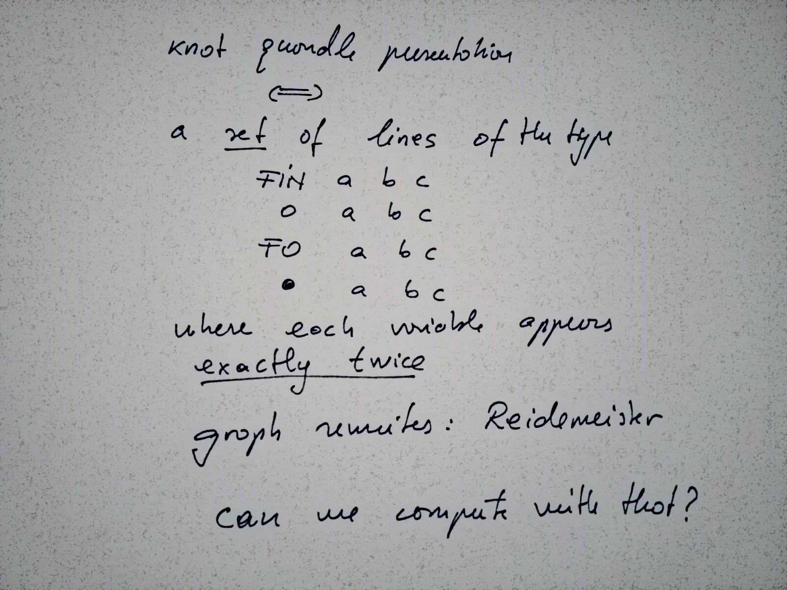

Can we compute with that?

**Theorem.** If there is a parser from lambda calculus to knot diagrams, such that any lambda calculus rewrite is parsed to a pair of knot diagrams which are equivalent under the Reidemeister moves, and such that there is a term sent to a diagram of the unknot, then all lambda terms are sent to diagrams of the unknot.

The proof is simple. Let A be the non empty set of all lambda terms which are parsed to a diagram of an unknot and let B the set of all other lambda terms.  By Haken we have an algorithm to detect the unknot and the Scott-Curry theorem tells us that B has to be empty. 

This shows that we can't hope to do computations with tangle diagrams and R moves only, with the algorithm of random application of rewrites (or with any local algorithm), because if we could then we can also turn any graph representing a lambda term to the unknot.

We can compute with knot diagrams, but in a stupid way: if we use diagrams as a notational device. 

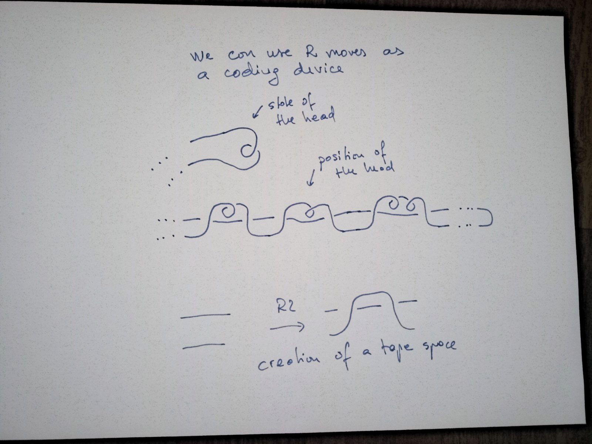

Indeed, take an unknot, flatten it and use parts of it for the head state and other parts for the tape symbols. The computation is then realized via R moves, but there are sequences or R moves which turn the diagram into the unknot, which do not correspond to a Turing machine computation. You may add  variations where we use such diagrams for headless Turing machines, or even for another universal computation model, the SKI combinators calculus [via chemSKI](https://mbuliga.github.io/chemski/chemski.html#SKInote).  We can't hope to use only the R moves, in a local way, to do universal computation. 

## Zip-Slip-Smash

I argue that we need to introduce a  way to reconnect edges. For this I introduce zippers. The idea is that a zipper is a thing which has two non-identical parts, so it’s made of two half-zippers, which are not identical. There will be two types of zippers: black and white. We also have ends (black and white) which are 1 valent, and of course crossings of two types, which are 4 valent nodes.

There are 4 types of half-zippers (two white, two black). Here you see them also in the mol notation.

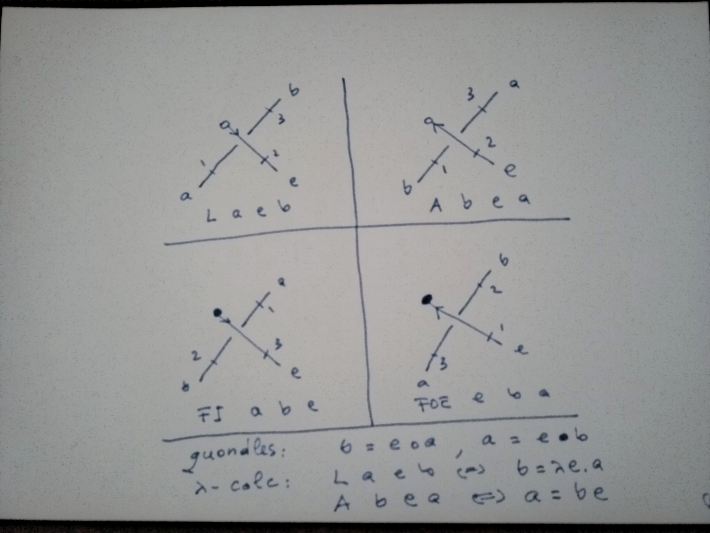

The L and A half-zippers are related to the lambda calculus abstraction and application operations, like in [chemlambda](https://mbuliga.github.io/quinegraphs/history-of-chemlambda.html#ChemlambdaV2). 

We also have crossings, which are 4 valent nodes. Each crossing is represented in the mol notation by a pair of lines. 

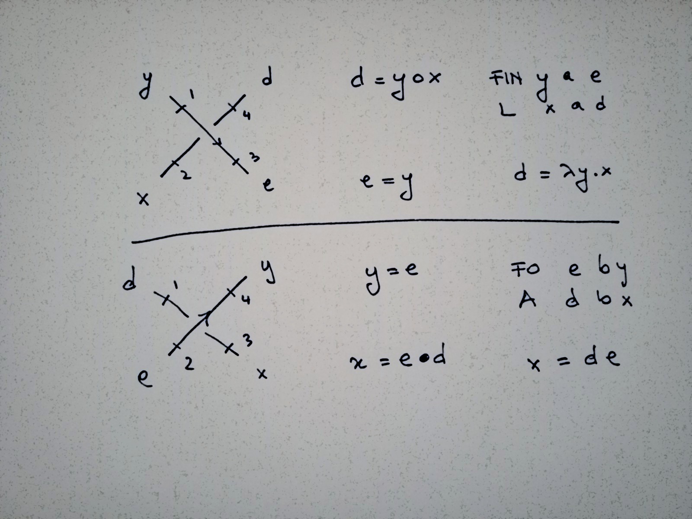

This corresponds to the usual way to see a crossing (which is 4 valent) as if it is a pair of two 3 valent nodes, one of them being a fanin (FIN) or a fanout (FO). 

Now let's see the rewrites which give the name of ZSS: zip, slip, smash. 

There are two **zip rewrites**. The first one uses only white half-zippers.

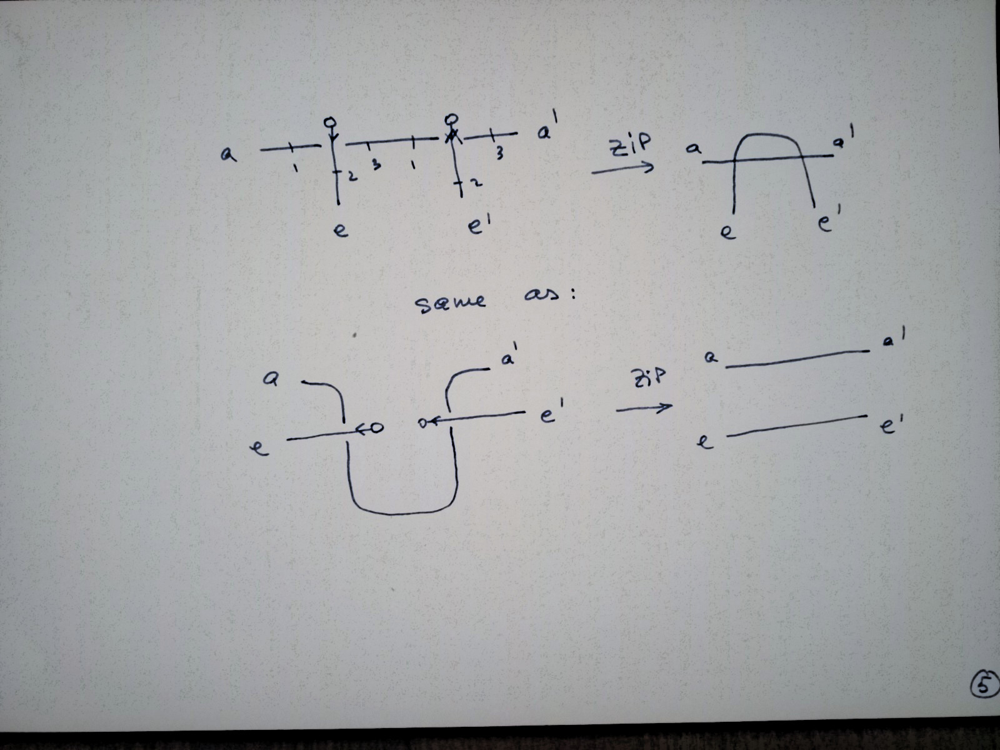

It can be used to make diagrams and rewrites which really look like zippers.

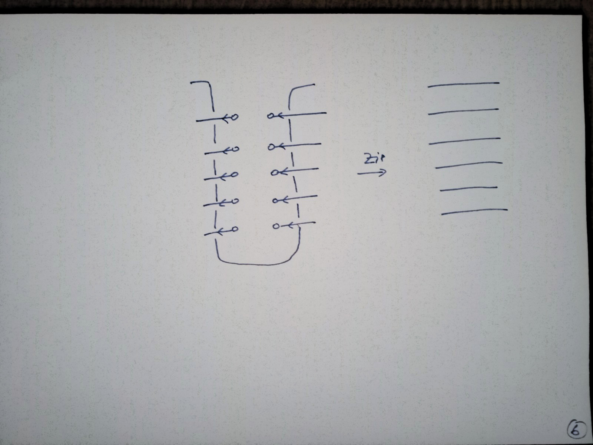

The second zip rewrite uses only black half-zippers: 

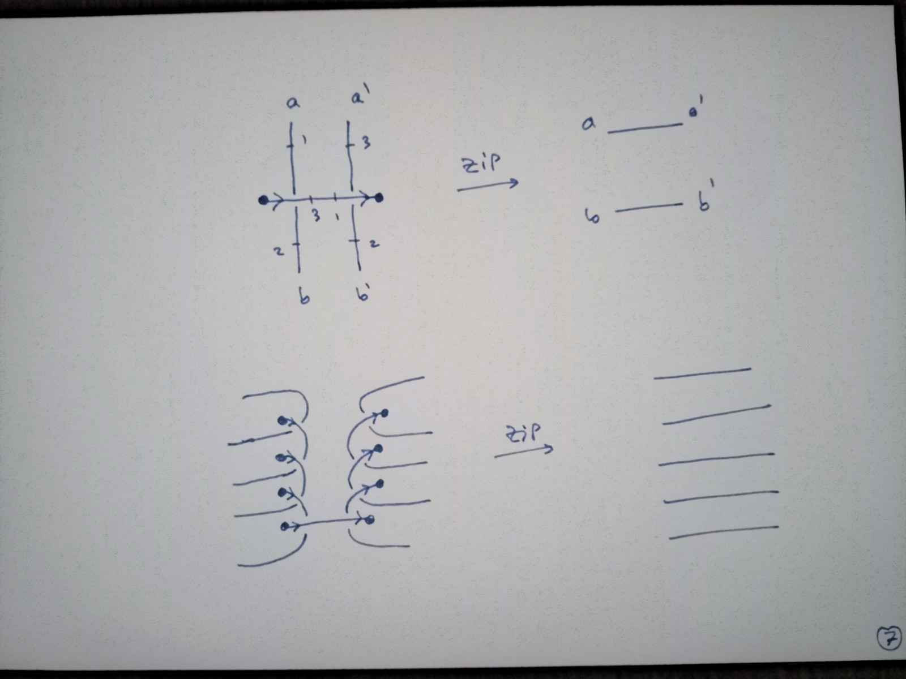

With this we can make black zippers as well.

The **slip rewrites** are introduced because there is a graphical ambiguity in the drawing of a half-zipper. We see there an end (black or white) and a crossing, or is there a black or white half-zipper? 

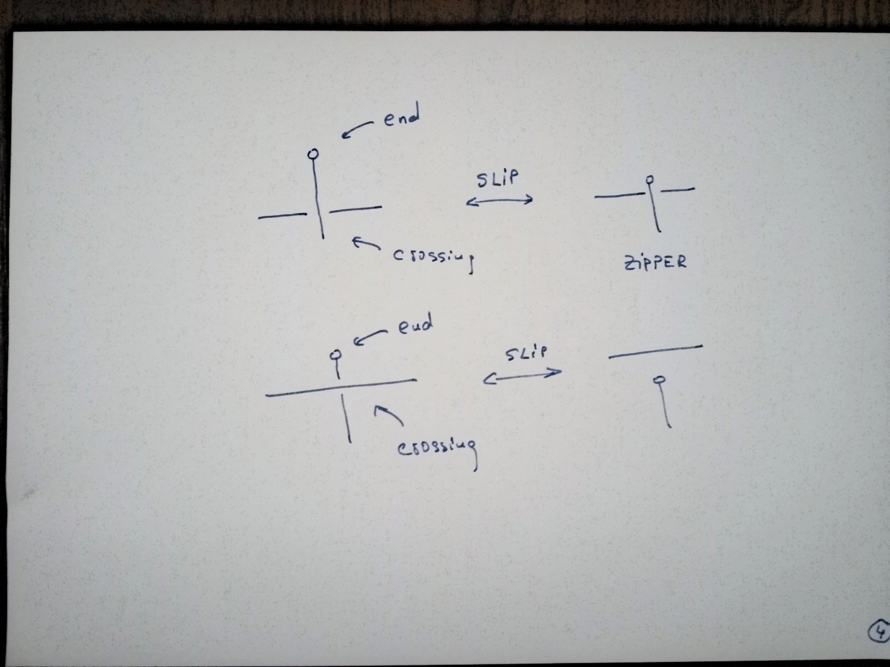

The slip rewrites tell us that ends (of any color) which pass over the crossing are the same as half-zippers, and also that ends which pass under the crossing ... slip under and the crossing is destroyed. S. Carter mentions that such rewrites appear also in Geometric Interpretations of Quandle Homology  [arXiv:math/0006115v1](https://arxiv.org/abs/math/0006115v1) .

 The  **smash rewrites** create half-zippers. Imagine that you smash a crossing with a hammer and it breaks down into two half-zippers. (Mind that all rewrites are bi-directional though, so you can also turn a pair of half-zippers into a crossing). The first smash rewrite is 

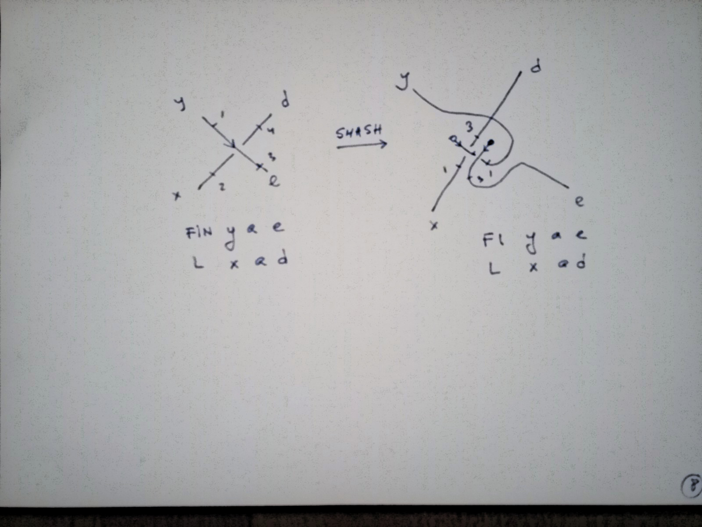

We see that, in the mol notation, it turns a FIN fanin into a FI 3 valent node, in the presence of a L node. Conversely, a pair of half-zippers (black and white) connected as shown, turns into a crossing. 

The second smash rewrite involves the other pair of black and white half-zippers. 

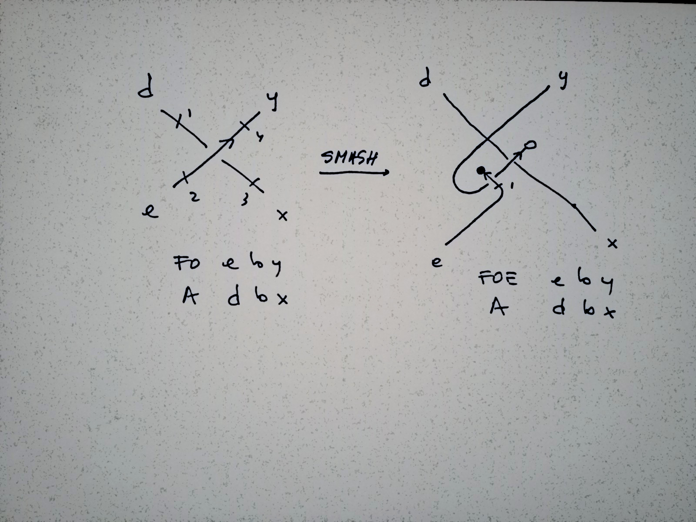

Finally, we have the **crossings rewrites**! They are the R1, R2, R3 familiar graph rewrites which involve only crossings. 

In conclusion ZSS is a graph rewrite system which enlarges the Reidemeister rewrites with supplimentary ones (zip, slip, smash) which allow reconnection of edges, and tangle graphs with some 3 valent and 1 valent nodes. 

ZSS is an improved version of [Zipper logic (figshare)](https://doi.org/10.6084/m9.figshare.1032660.v1) or [arXiv:1405.6095 [math.CO]](https://arxiv.org/abs/1405.6095). 

Indeed, the original zipper logic used tangles with zippers, but there were also fanins and fanout nodes. Here the fanins and fanouts are embedded into crossings. Also, the duplication rewrites of zipper logic are not local, in the sense that whole combinations of half-zippers duplicate at once. Here we have rewrite duplications which are built from more simple pieces. 

As an example, here is a duplication rewrite (L-FOE) in ZSS: 

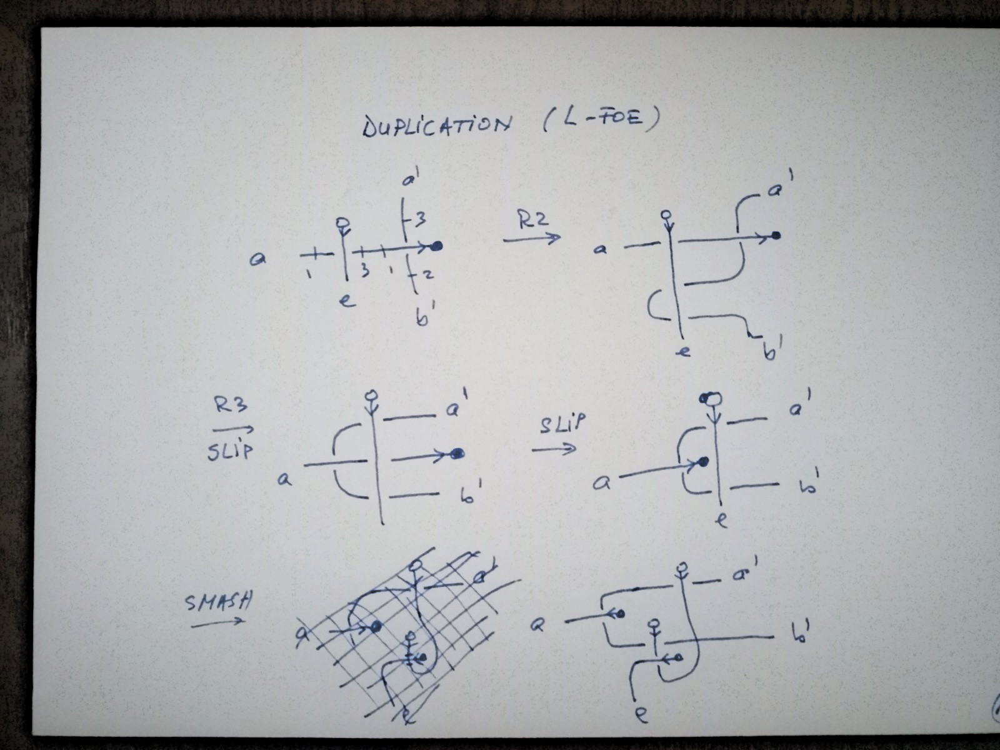

Actually we can give a similar proof of the duplication FI-A. Together with the two zip rewrites and with the slip rewrites, we obtain all rewrites of dirIC. 

**Theorem.** ZSS is universal, because it implements directed [Interaction Combinators (dirIC)](https://mbuliga.github.io/quinegraphs/ic-vs-chem.html#icvschem). 

Recall that once we have the nodes L, FI, A, FOE and the mentioned rewrites, then indeed we can reconstruct Lafont' Interaction combinators by grouping A, L and FI, FOE. 

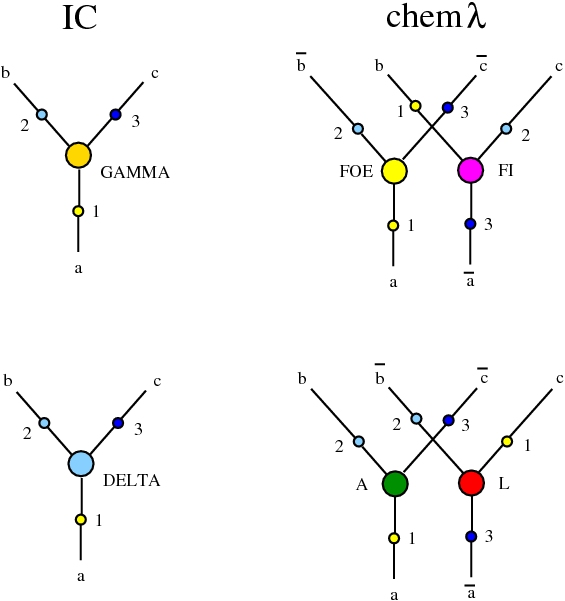

Not shown, the IC rewrites which delete nodes correspond to slip rewrites in ZSS. 

It is very interesting that in ZSS we obtain after smash rewrites pairs of L, FI or A,FOE nodes. Compare with the groupings L,A or FI,FOE of dirIC. 

Moreover in ZSS we have the Reidemeister rewrites for crossings, which are really useful, as shown in the L-FOE rewrite, which is obtained from R2, R3, slip and smash rewrites. 

## Questions

  * How can we add a passage to the limit like in emergent algebras? 

  * How is this compatible with Pure See? 

  * Is smash a rewrite which represents a measurement, if we were to try to use ZSS for quantum computing?

